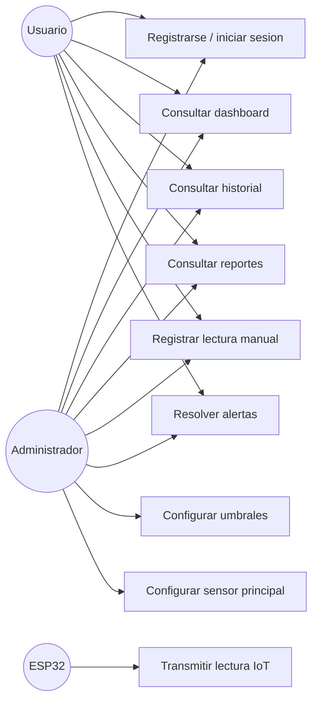

# Casos de uso

```mermaid
flowchart LR
  Admin((Administrador))
  User((Usuario))
  ESP((ESP32))

  UC1[Registrarse / iniciar sesion]
  UC2[Consultar dashboard]
  UC3[Consultar historial]
  UC4[Consultar reportes]
  UC5[Registrar lectura manual]
  UC6[Resolver alertas]
  UC7[Configurar umbrales]
  UC8[Configurar sensor principal]
  UC9[Transmitir lectura IoT]

  Admin --> UC1
  User --> UC1
  Admin --> UC2
  User --> UC2
  Admin --> UC3
  User --> UC3
  Admin --> UC4
  User --> UC4
  Admin --> UC5
  User --> UC5
  Admin --> UC6
  User --> UC6
  Admin --> UC7
  Admin --> UC8
  ESP --> UC9
```
